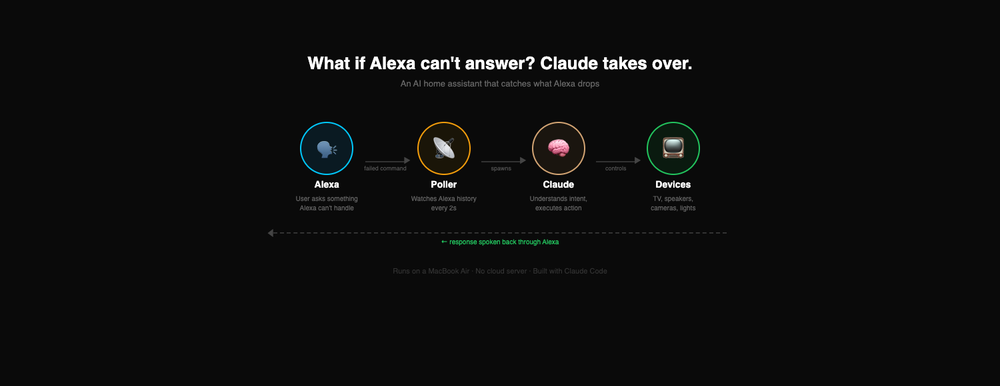

# hey-claude

**When Alexa can't answer, Claude takes over.**

A lightweight AI home assistant that catches failed Alexa commands, routes them to Claude, and executes them — controlling your TV, speakers, cameras, and more.



## Key design decisions

- **One Claude session per command** — Fast, cheap (Haiku), no long-running process
- **CLAUDE.md as memory** — Claude reads it every session, learns across sessions by writing back to it
- **Plug-and-play devices** — Drop a folder in `devices/`, write a `device.md`, and Claude auto-discovers it
- **Failure blacklist in poller** — Only routes genuinely failed commands to Claude; successful Alexa responses are skipped
- **60s dedup window** — Prevents feedback loops when Claude's actions trigger new Alexa events
- **Dynamic response delay** — Waits for Alexa to finish speaking (~20 chars/sec) before Claude responds
- **Processing beeps** — Audio feedback while Claude is working so you know it's alive

## File structure

```
├── core/
│   ├── poller.js             # Polls Alexa voice history, filters failures
│   ├── watch.sh              # Watches for commands, spawns Claude, auto-loads device docs
│   └── alexa/                # Alexa voice interface
│       ├── auth.js           # Authentication (generates cookie_data.json)
│       └── control.js        # speak, announce, textcommand, volume
│
├── devices/                   # Plug-and-play device integrations
│   ├── lg-webos-tv/
│   │   ├── lg_tv.js          # WebSocket (SSAP) control
│   │   └── device.md         # Instructions for Claude (auto-included)
│   ├── cpplus-dvr/
│   │   ├── stream.sh         # RTSP → HLS → TV browser
│   │   ├── dvr.sh            # Snapshot, record, motion detection
│   │   ├── player.html       # Fullscreen video player
│   │   └── device.md         # Instructions for Claude (auto-included)
│   ├── jio-stb/
│   │   ├── cast.sh           # DLNA casting, volume, CCTV
│   │   ├── dial.sh           # YouTube, Netflix via DIAL
│   │   └── device.md         # Instructions for Claude (auto-included)
│
├── config.json                # Your device IPs, MACs, network (gitignored)
├── config.example.json        # Template
├── CLAUDE.md                  # Your preferences + learnings (gitignored)
├── CLAUDE.md.example          # Template
├── STATE.md                   # Device state (gitignored)
└── README.md
```

## How it works

1. You speak a command to Alexa
2. Alexa can't handle it ("Sorry, I don't know that")
3. A **poller** watches Alexa's voice history every 2s and catches the failure
4. A **watcher** (100ms polling) detects the new command and spawns a **Claude Haiku** session
5. Claude understands the intent, executes the action (TV on/off, launch apps, play music, etc.)
6. The response is spoken back through Alexa in a male voice (Matthew via SSML)

While Claude is processing, you hear a beep sound so you know it's working.

## Architecture

- **Poller** (`core/poller.js`) — Connects to Alexa via `alexa-remote2`, pulls voice history, filters failed commands
- **Watcher** (`core/watch.sh`) — Detects new failed commands, handles deduplication, spawns Claude sessions
- **Claude sessions** — One Haiku session per command, reads `CLAUDE.md` for context, executes via bash
- **LG TV control** (`devices/lg-webos-tv/lg_tv.js`) — Direct WebSocket (SSAP) control: power, volume, apps, screenshots
- **Alexa control** (`core/alexa/`) — Speak, volume, text commands, announcements
- **CCTV streaming** (`devices/cpplus-dvr/stream.sh`) — Live camera feed on TV: DVR (RTSP) → ffmpeg (HLS) → TV browser
- **Jio STB** (`devices/jio-stb/`) — DLNA casting, YouTube/Netflix via DIAL

## Setup

### Prerequisites

- Node.js 18+
- An Amazon Echo device
- [Claude CLI](https://docs.anthropic.com/en/docs/claude-code) installed and authenticated
- Devices on the same local network

### 1. Clone and install

```bash
git clone https://github.com/rg321/hey-claude.git
cd hey-claude
cd core/alexa && npm install && cd ../..
```

### 2. Authenticate with Alexa

```bash
cd core/alexa
node auth.js
# Opens a browser — log in with your Amazon account
# Saves cookie_data.json (gitignored)
```

### 3. Configure devices

```bash
cp config.example.json config.json
```

Edit `config.json` with your device IPs, MAC addresses, and network details. This file is gitignored.

### 4. Configure CLAUDE.md

```bash
cp CLAUDE.md.example CLAUDE.md
```

Add your personal preferences (language, device nicknames, aliases). Device instructions are auto-loaded from `devices/*/device.md` — no need to add them here.

### 5. Start

```bash
# Start the poller (watches Alexa voice history)
nohup node core/poller.js > poller.log 2>&1 &

# Start the watcher (spawns Claude sessions for failed commands)
nohup bash core/watch.sh > /dev/null 2>&1 &
```

Now speak to Alexa. If she can't handle it, Claude will.

## Supported devices

| Device | Protocol | What it can do |
|--------|----------|----------------|
| **LG WebOS TV** | WebSocket (SSAP) | Power on/off, volume, launch apps (YouTube, Netflix, Spotify), screenshots, screen on/off |
| **Alexa Echo Dot** | alexa-remote2 | Speak, play music, text commands, announcements |
| **CP Plus DVR** | RTSP + HTTP | Live camera feed on TV, snapshots, record clips, motion detection |
| **Jio Set Top Box** | DLNA + DIAL | Cast media, YouTube, Netflix, volume, CCTV streaming |
| **Smart Lights** | — | Planned |

> **CCTV on TV** — Say "show camera on TV" and it spins up a live feed: DVR → ffmpeg (HLS) → fullscreen TV browser. Auto-stops when you switch away.

## Adding new devices

1. Create a folder under `devices/` (e.g. `devices/philips-hue/`)
2. Add your control script (e.g. `index.js` or `control.sh`)
3. Write a `device.md` describing the commands Claude can use
4. Add device config to `config.json`
5. Done — `watch.sh` auto-includes your `device.md` in every Claude session

## Contributing

Contributions are welcome! Feel free to open issues or submit PRs — whether it's adding support for new devices, improving the failure detection, or making the pipeline faster.

## License

MIT
